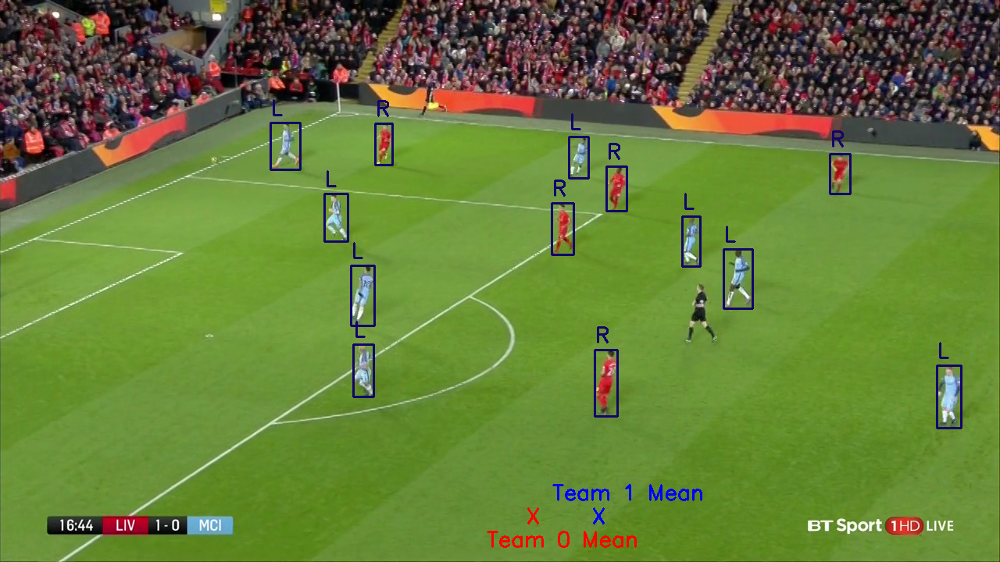

# Football Object Detection
This project utilizes object detection algorithms to analyze football matches videos by finding the position of different objects on the football pitch and classifying them into 7 different classes:  
0 - Player team left  
1 - Player team right  
2 - Goalkeeper team left  
3 - Goalkeeper team right  
4 - Ball  
5 - Main referee  
6 - Side referee  
7 - Staff members  
## Demo
https://github.com/Abdulkadir19997/Football_Object_Detection/output/CityUTdR_out.mp4


## Quick Guide

<details><summary>Install</summary>
  
```
git clone https://github.com/Abdulkadir19997/Football_Object_Detection.git
cd "./Football-Object-Detection"
pip install requirements.txt
```

</details>

<details><summary>Inference on video</summary>

To run the model on a video, run the following command: 
```
python main.py /path/to/video
```
The annotated video will be saved to "Football Object Detection/output" folder

</details>

## Object Detection model
The model used for object detection is <a href=https://github.com/ultralytics/ultralytics>YOLOv8</a>, it was trained on <a href=https://drive.google.com/drive/folders/17w9yhEDZS7gLdZGjiwPQytLz3-iTUpKm>SoccerNet Dataset</a> for 25 epochs, to classify the objects into only 5 different classes:  
0 - Player  
1 - Goalkeeper  
2 - Ball  
3 - Main referee  
4 - Side referee  
5 - Staff members  

## How it works ?  
The model uses the **first frame** of the video to extract some important information by performing the following steps:  
**1. Extracting the grass color**  
It works by selecting only the green colors in the frame and masking out all other elements, then taking the average color of the non-maksed parts  


**2. Finding the kit color of each one of the two teams**  
This can be done by cutting the players boxes out of the image and then removing the grass from the background of each player and finally get the average color of the remaining pixels, which will be the player's kit color, then the K-Means clustering alogrithm will be used on the BGR values of the kits colors, so that each team's kits will be clustered together in one group, with its centroid representing the team's kit color for future comparisons.


To remvoe the grass color from each player's background, I filter out the region of colors around the grass color that we got in the first step in the HSV color space.
  

**3. Labeling each team as left or right**  
To do this, I find the average position of each team's players on the x axis, and the team with the least average position value will be labeled as "Team Left" and the other one as "Team Right"
  

For **every frame** of the video, the model operates as follows:  
**1. Running YOLO model inference on the current frame**  
The model classifies each object into one of the 5 classes  


**2. Finding the kit color of each player**  
By using the same method as before, removing the grass background from the player's bounding box and getting the average color of the remaining pixels.  

**3. Classifying each player into "team 0" or "team 1"**  
This is done by finding out to which closest K-Means centroid (found in the first frame) to the player's kit color.


**4. Labeling each team as "Left" or "Right"**  
This is done by comparing the team's label (0 or 1) to the label of the "Team Left" found in the first frame

**5. Labeling each Goalkeeper**
The goalkeeper is labeled "GK Left" if he's found on the left hand side of the frame, and labeled "GK Right" otherwise.

Further explanation of the model can be found in the jupyter notebook.
